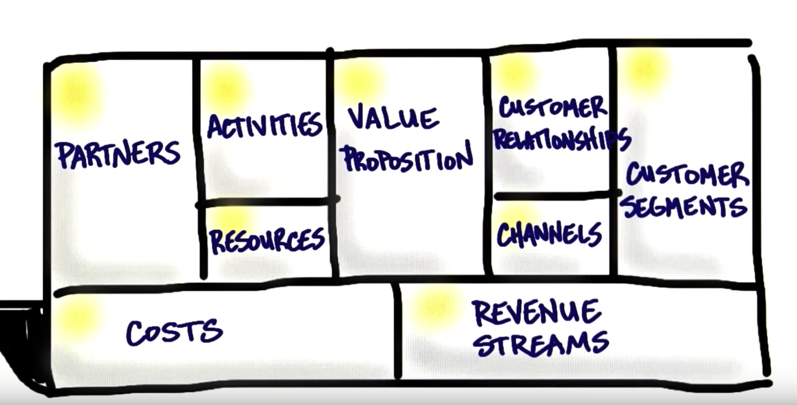
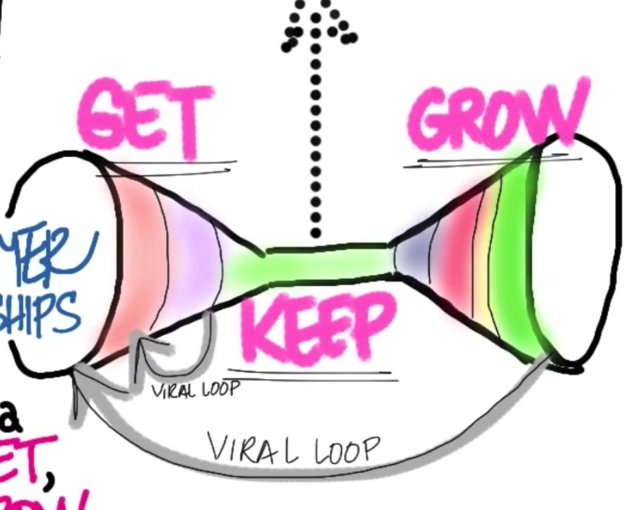

# Build A Startup

## What is a Company?
> A Business Organization which sells a product or service in exchange for Revenue or Profit.

## What is a Startup?
> According to Steve Blank, A Startup is a **TEMPORARY** organization designed to **SEARCH** for **REPEATABLE** and **SCALABLE** business model.

* Temporary: The goal of a startup is not to become a startup, but to become a company.
* Search: Obviously
* Repeatable: Search for a repeatable, smt that works from Monday to Sunday (Sales, Marketing, Product, Service)
* Scalable: I put a dollar in I get some more out. I should not be losing money.

ergo

# A STARTUP IS SEARCHING FOR A BUSINESS MODEL

                                 _
                                | \
                                | |
                                | |
           |\                   | |
          /, ~\                / /
         X     `-.....-------./ /
          ~-. ~  ~              |
             \             /    |
              \  /_     ___\   /
              | /\ ~~~~~   \ |
              | | \        || |
              | |\ \       || )
             (_/ (_/      ((_/
             
## Business Model

A Business Model is how a company creates values for itself while delivering products or services to its customers.

### 1. Value Proposition

What are you building and for who?

Its not about your IDEA or PRODUCT, but its for **solving a need** for the **customer**.

| Problems        | Needs           |
| ------------- |:-------------:|
| Accounting      | Entertained |
| Word Processing      | I wanna have a date      |
| Communicating Problem  | I wanna talk to my friends      |

##### Needs market is huge than Problems market.

### 2. Customer Segment

Who are my customers and why would they buy?

Your customers do not exist to buy, but you exist for them.

##### WHO ARE THEY?
##### WHY WOULD THEY BUY?
##### WHAT IS THEIR ARCHETYPE? (THEIR SOCIAL, GEOGRAPHIC, DEMOGRAPHIC)

There can be different types of our customers. But on day 1, all we have are hypothesis.

### 3. Channels

How does your product/service get to your customer? (We use distribution channels to do that).

### 4. Customer Relationships

How does a company get, keep, and grow customers?

### 5. Revenue Streams

How do you make money by selling your product to customers?

What value is the customer paying for? And what's the strategy of how I am gonna capture that value?

The only way to find out is through interactions with 10 of 100s of 1000s of customers.

### 6. Key Resources

What are the key resources/assets required to make the business model work?

* Finance
* Manufacturing Line
* Vans
* Intellectual Property
* Great Software Programmers
* Great Manufacturing People
* or what else?

### 7. Key Partners

Who are your key partners and suppliers?

Before making a deal:
- what are we acquiring from partners? 
- What key activites are they going to perform and when?

### 8. Key Activities

Whats the most important things that the startup need to do to make the business model work?

### 9. Cost

Everything in the left hand side adds up to give us the cost.

What are the entire cost to operate the business model?

* What are the most important costs?
* What are the most expensive resources?
* What key activities are the most expensive?
* Fixed cost? Variable cost?
* Economies of scale?

